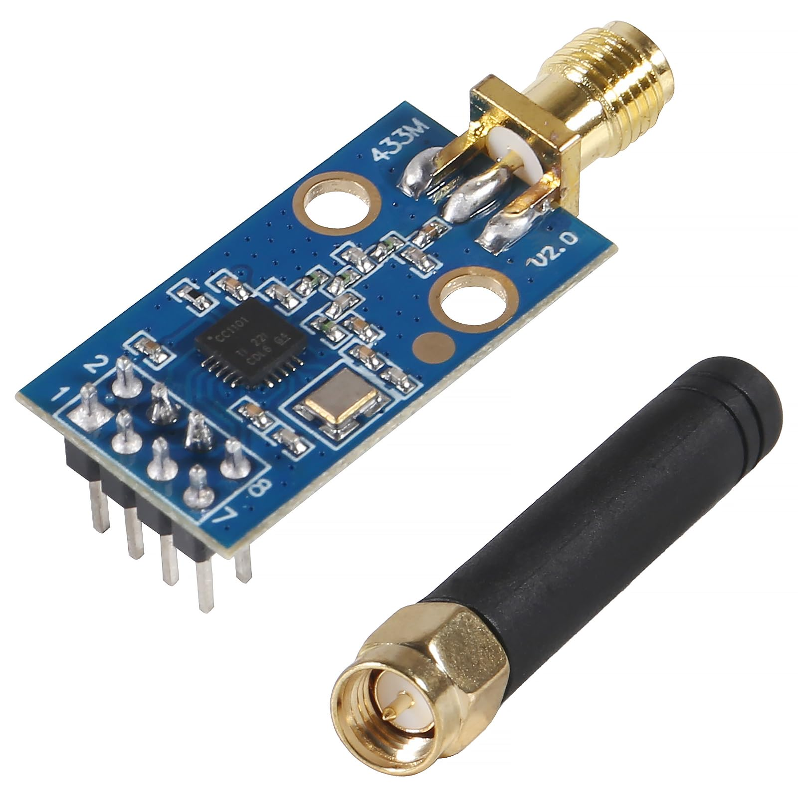
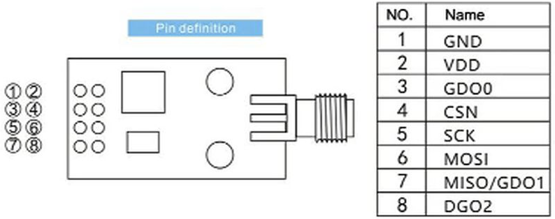
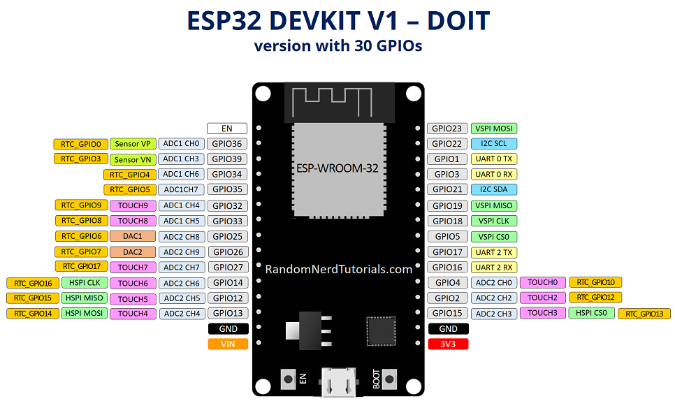
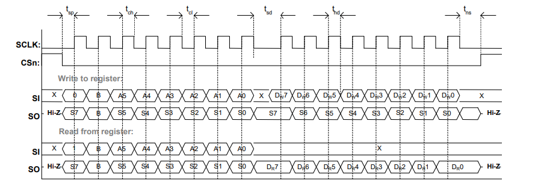
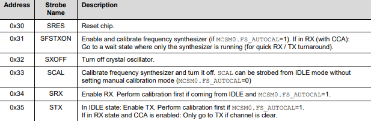
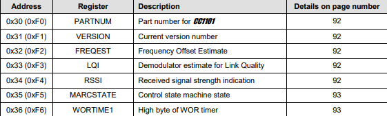

# ESP32-CC1101

<div align="center">

</div>

## Introduction

This project demonstrates how to write basic firmware for the CC1101 RF transceiver with the ESP32 using the ESP-IDF framework. In this demo, we will be accessing a [register](https://en.wikipedia.org/wiki/Hardware_register#:~:text=In%20digital%20electronics%2C%20a%20register,upon%20loss%20of%20operating%20power.) inside the CC1101 (and performing a few other operations). A successful read of this register will confirm we have set up our devices to communicate successfully. The relevant code can be found in `main/main.cpp`. 
> Note: We use ESP-IDF here for full control and learning purposes, but Arduino can be a simpler option for long-term development.

Writing this firmware can be accomplished in five steps:
- Acquiring prerequisites (hardware, software)
- Wiring the appropriate pins from the CC1101 to the ESP32
- Initializing an SPI bus on the ESP32 
- Add the CC1101 as a device on that bus
- Transmitting and receiving data between the devices

This README will reference the [ESP32 documentation](https://docs.espressif.com/projects/esp-idf/en/stable/esp32/api-reference/peripherals/spi_master.html) and the official [TI CC1101 transceiver datasheet](https://www.ti.com/lit/ds/symlink/cc1101.pdf). Basic programming experience, familiarity with the [SPI interface](https://www.analog.com/en/resources/analog-dialogue/articles/introduction-to-spi-interface.html), and development board knowledge (Raspberry Pi, Arduino, ESP32) will be helpful to follow along.


## Table of Contents

1. [Prerequisites](#1-prerequisites)
   - [Hardware](#hardware)
   - [Software](#software)
2. [Wiring](#2-wiring)
3. [Initialize an SPI Bus](#3-initialize-an-spi-bus)
   - [Method: `spi_bus_initialize()`](#method-spi_bus_initialize)
   - [Determining Values](#determining-spi_bus_initialize-parameters)
4. [Add a Device](#4-add-a-device)
   - [Method: `spi_bus_add_device()`](#method-spi_bus_add_device)
   - [Determining Values](#determining-spi_bus_add_device-parameters)
5. [Register Access in the CC1101](#5-register-access-in-the-cc1101)
    - [SPI Accessible Types](#spi-accessible-types)
   - [Expected Transaction Format](#expected-transaction-format)
6. [Interact with the Device](#6-interact-with-the-device)
   - [Method: `spi_device_polling_transmit()`](#method-spi_device_polling_transmit)
   - [Determining Values](#determining-spi_device_polling_transmit-parameters)
   - [CC1101 Initialization Procedure](#cc1101-initialization-procedure)

# 1. Prerequisites

## Hardware

- CC1101 transceiver: The CC1101 is a low cost, low power sub-1 GHz RF transceiver designed for wireless applications in the 300-348 MHz, 387-464 MHz, and 779-928 MHz ISM/SRD bands. Commonly used with microcontrollers like Arduino, ESP8266, and the Flipper Zero for sub-GHz communication.

- ESP32: The ESP32 is a microcontroller with integrated Wi-Fi and Bluetooth, manufactured by Espressif Systems. It is widely used in IoT (Internet of Things) projects due to its powerful 32-bit dual-core processor, high performance, and versatility in smart home and wearable devices.

- Breadboard wires: Breadboard wires (or jumper wires) are flexible or solid core wires with pins on the ends used to create temporary, solderless connections on a breadboard for prototyping circuits.

This hardware is available for purchase on many online platforms such as AliExpress and Amazon.
## Software

- [Visual Studio Code](https://code.visualstudio.com/): A lightweight, extensible source code editor used to write and manage ESP32 projects.

- [ESP-IDF (Espressif IoT Development Framework)](https://docs.espressif.com/projects/esp-idf/en/stable/esp32/get-started/): The official development framework for ESP32, providing the toolchain, build system, drivers, and APIs.

- [Espressif IDF Extension for VS Code](https://marketplace.visualstudio.com/items?itemName=espressif.esp-idf-extension): An extension that integrates ESP-IDF into VS Code, enabling build, flash, monitor, and project management features.
- [Python 3.x](https://www.python.org): Ensure your Python version is compatible with the latest version of ESP-IDF.

# 2. Wiring

### CC1101 Pinout
 
### ESP32 pinout
 

> Note: The pinout can change based on the type of ESP32 and CC1101 module you own. Verify your board's pinout before wiring.

### Required SPI Connections

| CC1101 Pin | ESP32 Pin |
|------------|-----------|
| `VCC`        | `3.3V`      |
| `GND`        | `GND`       |
| `CSn`        | `GPIO 5`    |
| `MOSI`       | `GPIO 23`   |
| `MISO`       | `GPIO 19`   |
| `SCK`        | `GPIO 18`   |
| `GDO0`       | `GPIO 4`    |
| `GDO2`       | Optional / Not Used |
> [!WARNING]
> Ensure `VCC` on the CC1101 is connected to `3.3V` only. Applying 5V can damage the chip.

Once everything is wired up and the prerequisites are complete, we can begin writing firmware using ESP-IDF. If you're new to ESP-IDF, there are several videos online that can assist with setting up a project from scratch. I recommend watching [this one](https://www.youtube.com/watch?v=oHHOCdmLiII) and reading the official documentation for [getting started with ESP-IDF](https://docs.espressif.com/projects/esp-idf/en/stable/esp32/get-started/index.html). After your environment is ready, open `main.cpp` and we will begin implementing the SPI configuration.
# 3. Initialize an SPI Bus

### Method: `spi_bus_initialize()`
The protocol the CC1101 uses to physically communicate with other devices is called SPI, or Serial Peripheral Interface. It is one of three main protocols that embedded devices use to transmit data; the other two are known as I2C and UART. The purpose of each wire in the SPI protocol is shown below.

| Pin    | Full Name                | Purpose                             |
|--------|--------------------------|-------------------------------------|
| `MOSI` | Master Out, Slave In     | Sends data to the CC1101            |
| `MISO` | Master In, Slave Out     | Receives data from the CC1101       |
| `SCK`  | Serial Clock             | Synchronizes data transfer          |
| `CSn`  | Chip Select              | Selects the CC1101 for communication|
 
An important concept in the SPI protocol is known as the SPI bus, where the SPI bus is essentially a group of shared wires that transfer data. These wires map to the four pins of the SPI protocol including: the `MOSI`, `MISO`, `SCK`, and `CSn` pins. `spi_bus_initialize` tells the ESP32 to configure the SPI bus according to our specifications including which SPI controller to select and which pins we are using for this bus. We initialize the SPI bus using:

- [`spi_bus_initialize()`](https://docs.espressif.com/projects/esp-idf/en/stable/esp32/api-reference/peripherals/spi_master.html#_CPPv418spi_bus_initialize17spi_host_device_tPK16spi_bus_config_t14spi_dma_chan_t)

This function requires:

- [`spi_host_device_t`](https://docs.espressif.com/projects/esp-idf/en/stable/esp32/api-reference/peripherals/spi_master.html#_CPPv417spi_host_device_t)
- [`spi_bus_config_t`](https://docs.espressif.com/projects/esp-idf/en/stable/esp32/api-reference/peripherals/spi_master.html#_CPPv416spi_bus_config_t)
- [`spi_dma_chan_t`](https://docs.espressif.com/projects/esp-idf/en/stable/esp32/api-reference/peripherals/spi_master.html#_CPPv414spi_dma_chan_t)

```cpp
#include <iostream>
#include "esp_log.h"
#include "driver/spi_master.h"
#include "freertos/FreeRTOS.h"


extern "C" void app_main(void) {
    spi_bus_config_t busConfig = {};
    busConfig.MOSI_io_num = GPIO_NUM_23;
    busConfig.MISO_io_num = GPIO_NUM_19;
    busConfig.sclk_io_num = GPIO_NUM_18;
    busConfig.quadwp_io_num = -1; 
    busConfig.quadhd_io_num = -1;
    spi_bus_initialize(SPI3_HOST, &busConfig, SPI_DMA_DISABLED);
    ...
}
```
> Note: We can wrap our spi functions with an error handler to ensure errors propagate correctly and get logged to the console such as: `ESP_ERROR_CHECK(spi_bus_initialize(SPI3_HOST, &busConfig, SPI_DMA_DISABLED));`.

### Determining spi_bus_initialize parameters
- SPI3_HOST
    - The SPI controller you are selecting. There are four SPI controllers on the classic ESP32. Two are tied to internal ESP32 operations, while `SPI2_HOST` and `SPI3_HOST` are available for public interfacing.
- busConfig
    - MOSI_io_num: The GPIO pin that connects the `MOSI` pin.
    - MISO_io_num: The GPIO pin that connects the `MISO` pin.
    - sclk_io_num: The GPIO pin that connects the SCLK pin.
    - quadwp & quadhd: Set to -1 indicating we are not using these.
- SPI_DMA_DISABLED
    - Controls whether the SPI driver uses Direct Memory Access for transfers. DMA can be disabled for small and simple transfers. 
> Note: If we were to set SPI_DMA_CH_AUTO, we would have to change how we manage memory such as using `uint8_t* tx = (uint8_t*) heap_caps_malloc(64, MALLOC_CAP_DMA);`. Optional further reading on DMA is recommended.

# 4. Add a Device 

### Method: `spi_bus_add_device()`

An SPI bus can have multiple devices using it. All devices would share the `MOSI`, `MISO`, and `SCK` lines. Each device would have its own `CSn` line that determines which device the master (ESP32) would listen to. This method will let the ESP32 know how to interact with our CC1101 by specifying which host it belongs to, what clock speed to use, etc. We add the CC1101 using:

- [`spi_bus_add_device()`](https://docs.espressif.com/projects/esp-idf/en/stable/esp32/api-reference/peripherals/spi_master.html#_CPPv418spi_bus_add_device17spi_host_device_tPK29spi_device_interface_config_tP19spi_device_handle_t)

This function requires:

- [`spi_host_device_t`](https://docs.espressif.com/projects/esp-idf/en/stable/esp32/api-reference/peripherals/spi_master.html#_CPPv417spi_host_device_t)
- [`spi_device_interface_config_t`](https://docs.espressif.com/projects/esp-idf/en/stable/esp32/api-reference/peripherals/spi_master.html#_CPPv429spi_device_interface_config_t)
- [`spi_device_handle_t`](https://docs.espressif.com/projects/esp-idf/en/stable/esp32/api-reference/peripherals/spi_master.html#_CPPv419spi_device_handle_t)


```cpp

extern "C" void app_main(void) {
    ...
    spi_device_interface_config_t deviceConfig = {};
    spi_device_handle_t cc1101; 
    deviceConfig.command_bits = 0; 
    deviceConfig.address_bits = 0;
    deviceConfig.dummy_bits = 0;
    deviceConfig.clock_speed_hz = 1000000;
    deviceConfig.spics_io_num = GPIO_NUM_5;
    deviceConfig.queue_size = 1; 
    deviceConfig.mode = 0;

    spi_bus_add_device(SPI3_HOST, &deviceConfig, &cc1101);
    ...
}
```

###  Determining spi_bus_add_device parameters

- SPI3_HOST
    - Use the same host that you specified in the bus configuration step.
- deviceConfig
    - command, address, & dummy bits: The CC1101 does not have any phases specified in a transfer (see section 10: 4-wire Serial Configuration and Data Interface in the CC1101 datasheet).
    - clock_speed_hz: Table 22 in the CC1101 datasheet specifies the max frequency as 6-10 MHz depending on the action. This value should be lower than that.
    - spics_io_num: The GPIO pin we wired `CSn` to. Setting this allows the ESP32 to automatically know when to start listening to the CC1101. Use -1 if you want to control the chip select manually. If you are to control it manually, read section 10 of the CC1101 datasheet where it specifies the `CSn` pin values.
    - queue_size: Set to 1 as our program is only using synchronous methods (such as `spi_device_polling_transmit()`).
    - mode: [The SPI mode](https://www.analog.com/en/resources/analog-dialogue/articles/introduction-to-spi-interface.html) is determined by a combination of the Clock Polarity (CPOL) and the Clock Phase (CPHA). From the diagram (figure 15 in the CC1101 datasheet), we can see the SCLK line starts and idles low. So the CPOL is zero. We can also see that the lines indicate data is sampled on the rising edge of the SCLK signal, meaning the CPHA is zero. A combination of CPOL = 0 and CPHA = 0 means the SPI mode is 0. 
- cc1101
    - An arbitrary name that should correspond to the device you are using. We will reference this in our transactions. 

# 5. Register Access in the CC1101

### SPI accessible types
The CC1101 exposes three main SPI accessible types: configuration [registers](https://en.wikipedia.org/wiki/Hardware_register), status registers, and command strobes. 

- Configuration registers are read/write and control radio parameters like frequency, modulation, and packet behavior. 

- Status registers are read-only and report internal state information such as `PARTNUM`, `VERSION`, `RSSI`, and `FIFO` status.

- Command strobes are not registers, but actually single byte instructions that immediately trigger actions inside the radio such as system reset (`SRES`), enter receiver mode (`SRX`), or enter transmit mode (`STX`).

### Expected Transaction Format
The CC1101 does not have separate phases for sending bytes (no separate command phase, address phase, etc). It shifts a single bit in and out of the `MISO` and `MOSI` lines every clock pulse. The important takeaway is that every SPI transaction starts with a header byte that follows this format:

<div align='center'>
   
| Bit Position | Field Name | Width | Description | Values |
|--------------|------------|--------|------------|--------|
| 7 | R/W | 1 bit | Determines if operation is read or write | `0` = Write<br>`1` = Read |
| 6 | Burst | 1 bit | Determines single or multi-byte access | `0` = Single access<br>`1` = Burst access |
| 5–0 | Address | 6 bits | Register address or command strobe | `0x00 – 0x3F` |
</div>

- Bit position 7 tells the CC1101 if we are reading an address or writing to an address.
- Bit position 6 specifies if we are using single or multi-byte access. We will not be implementing multi-byte access in this guide.
- Bit position 5-0 is the address that we want to interact with.
  
<a id="differentiate"></a>

One important thing to know is that there is a special interaction between status registers and command strobes: they can share the same address. This is known as 'overloading' a register. The way we differentiate between them at the same address is with the burst and R/W bits.

For example, the address `0x30` contains the command strobe `SRES` AND the `PARTNUM` status register. The difference is that when we construct our header byte, we must set the burst and R/W bits to `1` if we want to access the status register at this address and leave them as `0` if we want to send a command strobe. The table below shows how we form the different bytes for each case:
<div align='center'>

| Name     | Address (Hex) | Header Byte (Hex) | Address (Binary) | Header Byte (Binary)   |
|----------|---------------|-------------------|------------------|------------------------|
| `SRES`   | `0x30`        | `0x30`            | `0011 0000`      | `0011 0000`            |
| `PARTNUM`| `0x30`        | `0xF0`            | `0011 0000`      | `1111 0000`            |
</div>

Below are some relevant addresses with different command strobes (Table 42) and status register values (Table 44). Note that the parenthesis in table 44 contain the header byte you would send to access the registers.

<div align="center">
<strong>Table 42: Command Strobes</strong><br>

<br><br>
<strong>Table 44: Status Registers</strong><br>


</div>

> [!IMPORTANT]
> Similar to how the first thing we send is a header byte during an SPI transaction, the first thing the CC1101 will always respond with is a Chip Status Byte. One important detail is that the number of bytes sent in a transaction is always equal to the number of bytes received. This is due to the nature of the SPI protocol; it is a full duplex, so the slave can only send bits while the master clocks it. 
> For more information, see sections 10.1 and 10.2 on the CC1101 datasheet. Further reading about the [SPI protocol](https://www.analog.com/en/resources/analog-dialogue/articles/introduction-to-spi-interface.html) is recommended if a full-duplex SPI is unfamiliar.
> 
>  Example: To read the value in the `PARTNUM` register, we would send `1` (read) `1` (burst bit for overloaded register) `110000` (the address where this register is located). `1111 0000` = `0xF0`. Since data can only be received while the master is transmitting, we must send two bytes: `0xF0` `0x00`. In return, we receive two bytes corresponding to the Chip Status Byte and the actual register value. Sending only the byte `0xF0` would give us the chip status byte, but not the actual register value. `0x00` functions as a dummy byte meant to give time (clock cycles) for the slave to send back the requested data.
# 6. Interact with the Device

### Method: `spi_device_polling_transmit()`

This starts a transaction between the CC1101 and the ESP32. This will start clocking bits out of `MOSI` from a transmit buffer and collecting data into a receive buffer on `MISO` simultaneously. We perform transactions using:

- [`spi_device_polling_transmit()`](https://docs.espressif.com/projects/esp-idf/en/stable/esp32/api-reference/peripherals/spi_master.html#_CPPv427spi_device_polling_transmit19spi_device_handle_tP17spi_transaction_t)

This function requires:

- [`spi_device_handle_t`](https://docs.espressif.com/projects/esp-idf/en/stable/esp32/api-reference/peripherals/spi_master.html#_CPPv419spi_device_handle_t)
- [`spi_transaction_t`](https://docs.espressif.com/projects/esp-idf/en/stable/esp32/api-reference/peripherals/spi_master.html#_CPPv417spi_transaction_t)

```cpp

extern "C" void app_main(void) {
    ...
    spi_transaction_t version_register = {};
    uint8_t tx_v[2] = {0xF1, 0x00};
    uint8_t rx_v[2] = {0x00, 0x00};
    version_register.tx_buffer = tx_v;
    version_register.rx_buffer = rx_v;
    version_register.length = 16;
    spi_device_polling_transmit(cc1101, &version_register);
    ...
}
```
> Note: This functionality has been refactored into a helper function `transmit_data` in `main.cpp`.
### Determining spi_device_polling_transmit parameters 
- cc1101
    - The device name we created earlier in our process.
- version_register
    - tx_v: The Bytes we want to send to the CC1101. tx_v[0] will always be our header byte, which is `0xF1`. This corresponds to the `VERSION` register in the CC1101 (see Table 44 above or in the datasheet). The second byte is a dummy byte used to clock out the register value from the slave. This needs to be included, as every status register read will return two bytes: a chip status byte and the register value byte. In order to receive 2 bytes, we must send 2 bytes as well (due to the nature of the SPI protocol being a full-duplex).
    - rx_v: This buffer will be filled with the response of the slave. Again, we include two bytes in the buffer because that is what we expect to receive when we send two bytes. rx_v[0] will always be the chip status byte when the CC1101 fills the buffer.
    - length: We are sending two bytes, so that equals 16 bits.

After calling this method, simply logging out the version_register receive buffer will show us the value contained inside the `VERSION` register. As stated before, the first byte is a chip status byte. So we will receive a chip status byte located in rx_v[0] and the actual register value in rx_v[1]. The expected value in the `VERSION` register will be `0x14`. 

### CC1101 Initialization Procedure
Section 19.1 of the datasheet specifies the required sequence for powering up the CC1101. The system must be reset every time you turn on the power supply.

The government-approved method of accomplishing this is as follows:
- Pull `CSn` LOW, then drive it HIGH again
- Wait for `MISO` to go LOW
- Send `SRES`

This would require you to set spics_io_num to -1 when adding a device to the bus. Then, you would have to control the `CSn` manually. As specified by the data sheet in section 10.1, `CSn` will have to stay pulled low (set to `0` instead of `1`) during any SPI transaction. The `CSn` going low tells the ESP32 to open up communication with that device. Since multiple devices can share the same SPI bus, the ESP32 will only listen to the one that has `CSn` low. `CSn` going low is visualized in figure 15 of the datasheet [and displayed above](https://github.com/ryan2625/ESP32-CC1101/blob/main/assets/timing_transfer.png). 

Alternatively, you can send the command strobes `SRES`, `SIDLE`, and `SFTX` in that order. After this sequence, your device should be ready to use. See `strobe_reset` in `main.cpp`.

<!--
7. [Further Reading](#7-further-reading)

# 7. Further Reading
The [next guide in this series](https://github.com/ryan2625/CC1101-TX?tab=readme-ov-file#introduction) focuses on transmitting a signal with the ESP-IDF and the CC1101 and interpreting datasheets. It is noticeably more complex, but a great way to gain a deeper understanding about interacting with embedded devices!
-->


